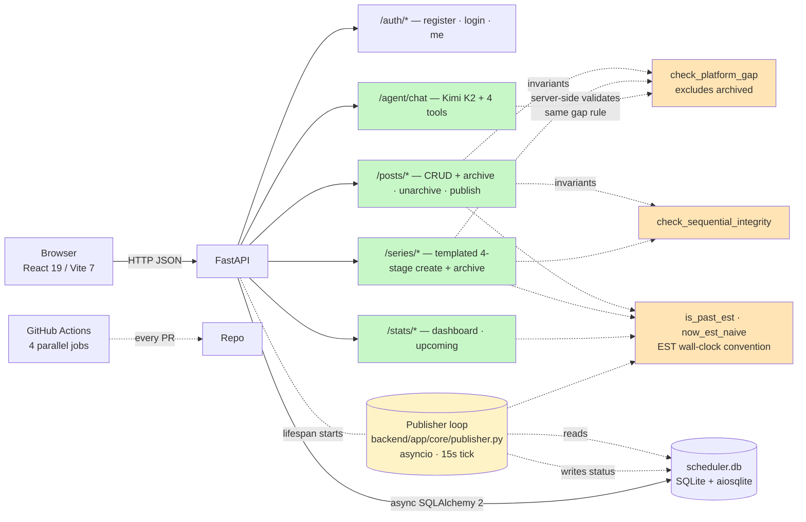
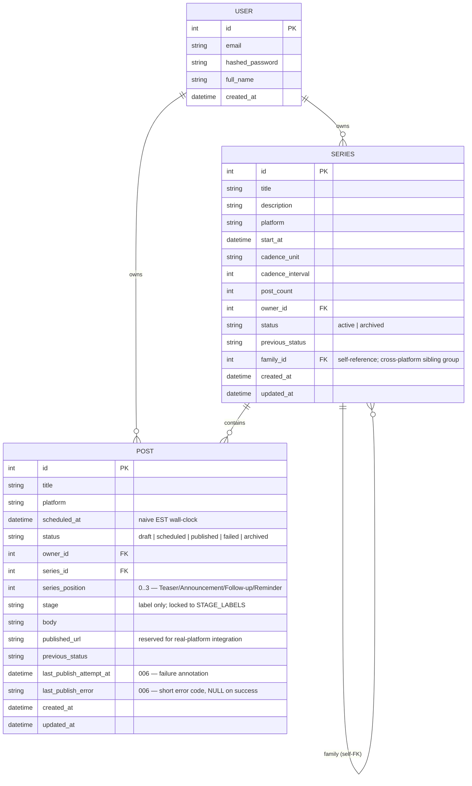
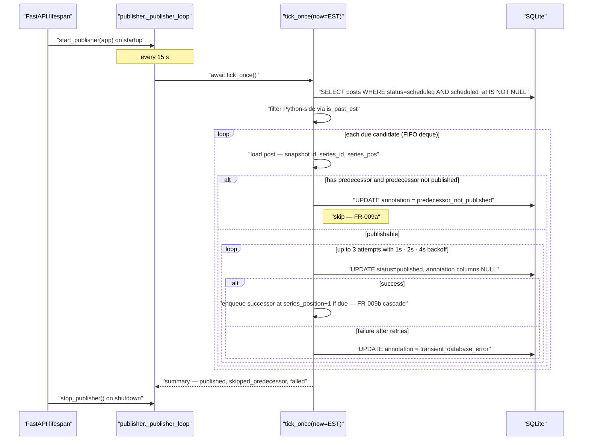
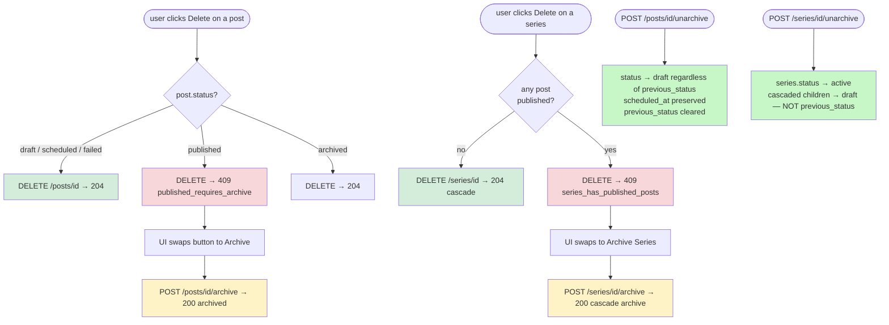
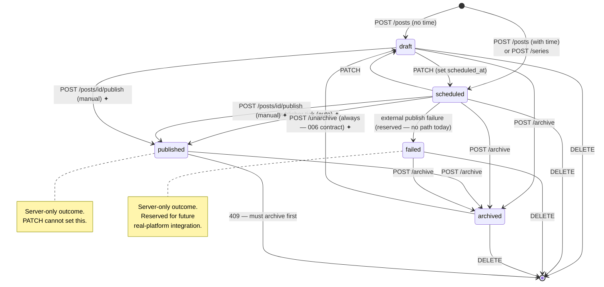
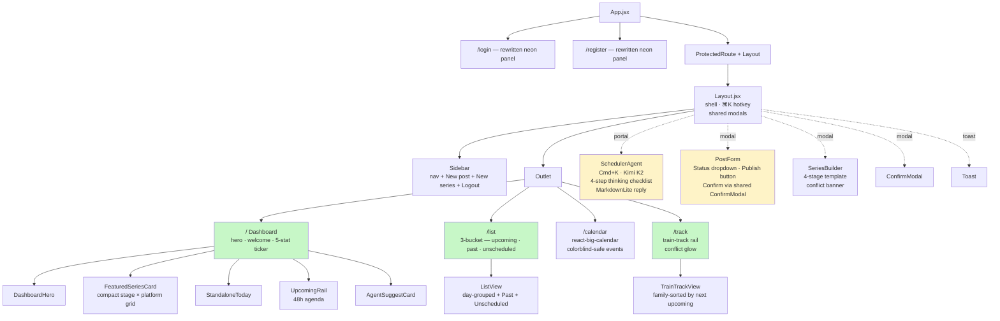

# High-Level Design (Final) — Creator Scheduler `main`

**Status**: ✅ Final — reflects the submitted state of `main` after 001 → 002 → 003 → 006 (with the abandoned `005-auto-publish-scheduled` lineage absorbed into 006).
**Last reviewed**: 2026-04-25
**Audience**: reviewer / new contributor approaching the codebase cold.

This document describes the **system as it ships**, not a delta against an earlier state. Changelogs live in git history and individual `specs/00X-*/` folders; this file is the single up-to-date map of the running product.

> **Why "final"**: 003 introduced the dashboard, archive model, and templated 4-stage series. 006 added auto-publish, manual publish, and status-transition lockdown. With 006 merged, the system has reached a stable shape — the next feature (real social-platform integration) would be a new spec, not an in-place rewrite.

---

## 1. System context



### REST surface (every route on the running server)

| Method | Path | Purpose |
|---|---|---|
| `POST` | `/api/v1/auth/register` | Create user |
| `POST` | `/api/v1/auth/login` | Issue JWT |
| `GET` | `/api/v1/auth/me` | Authenticated profile (drives dashboard greeting) |
| `GET` | `/api/v1/posts` | List with `?status=` `?platform=` `?include_archived=` filters |
| `POST` | `/api/v1/posts` | Create — enforces gap + past-time guard |
| `GET` | `/api/v1/posts/{id}` | Detail |
| `PATCH` | `/api/v1/posts/{id}` | Edit (also serves series-member edits) — re-checks gap, past, and series sequential integrity |
| `DELETE` | `/api/v1/posts/{id}` | Hard-delete; 409 `published_requires_archive` if status=published |
| `POST` | `/api/v1/posts/{id}/archive` | Soft-delete; preserves `previous_status` |
| `POST` | `/api/v1/posts/{id}/unarchive` | Always restores to `draft` (006 contract) — `scheduled_at` preserved |
| `POST` | `/api/v1/posts/{id}/publish` | Manual publish — bypasses series sequential rule |
| `POST` | `/api/v1/series` | Templated 4-stage create; supports `source_series_id` for cross-platform siblings |
| `GET` | `/api/v1/series` | List (with `include_archived`) |
| `GET` | `/api/v1/series/{id}` | Detail with embedded posts |
| `PATCH` | `/api/v1/series/{id}` | Edit title/description |
| `DELETE` | `/api/v1/series/{id}` | Hard-delete; 409 if any child is published |
| `POST` | `/api/v1/series/{id}/archive` | Cascade-archive the series + non-archived children |
| `POST` | `/api/v1/series/{id}/unarchive` | Restore series to `active`; cascaded children → `draft` |
| `GET` | `/api/v1/stats/dashboard` | Aggregated counts for the hero ticker |
| `GET` | `/api/v1/stats/upcoming` | Time-window query (used by the agent's `query_upcoming_posts` tool) |
| `POST` | `/api/v1/agent/chat` | Kimi K2 conversational scheduling — tool-calling loop, max 6 iterations |

### Time convention (project-wide)

All `scheduled_at` values on the wire and in storage are **naive ISO strings interpreted as EST wall-clock**. SQLite drops `tzinfo` on read, and the project-standard helpers (`scheduling.is_past_est`, `scheduling.now_est_naive`, `scheduling.to_est`; frontend mirrors `nowEstMs`, `parseIsoMs`) all live in this single frame of reference. The publisher's tick comparison and the dashboard's "next upcoming" filter use the same `is_past_est(scheduled_at, now=...)` semantics, so EST is honored from the auto-publish loop down through the UI.

---

## 2. Data model



### Status semantics

| Status | Set by | Allowed `*` → |
|---|---|---|
| `draft` | client (default) | `scheduled` (PATCH), `archived` (POST /archive), `published` (POST /publish) |
| `scheduled` | client | `draft` (PATCH), `archived` (POST /archive), `published` (auto via publisher OR POST /publish) |
| `published` | **server only** — auto-publish or POST /publish | `archived` (POST /archive). No PATCH path; client cannot set this. |
| `failed` | **server only** — reserved for future external-publish failure | Same. Client cannot set; today no path produces it. |
| `archived` | client (POST /archive) | `draft` (POST /unarchive — always lands in draft, never the previous status) |

`PostStatusUserSettable = Literal["draft", "scheduled", "archived"]` narrows what the client may write on `POST /api/v1/posts` and `PATCH /api/v1/posts/{id}`. Pydantic returns 422 on `published` / `failed`.

### Failure-annotation lifecycle

`last_publish_attempt_at` and `last_publish_error` are co-managed:

- **Both NULL** → clean state.
- **Both set** → the publisher's last attempt failed; the next tick will retry. The frontend renders a "⚠ retry pending" inline badge and an amber row inside the post edit form.
- A successful publish (auto or manual) resets both to NULL atomically with the status flip.

Stable error codes (see `specs/006-auto-publish-flow/data-model.md`):

- `transient_database_error` — DB write failed after 3 in-tick retries.
- `predecessor_not_published` — series stage's `series_position - 1` predecessor is not yet `published`.
- `unknown_internal_error` — catch-all; frontend treats unrecognized codes as this.

---

## 3. Series creation (templated 4-stage with cross-platform sibling)

```mermaid
sequenceDiagram
    participant UI as "SeriesBuilder modal"
    participant API as "POST /api/v1/series"
    participant SI as "check_sequential_integrity"
    participant SG as "check_platform_gap"
    participant DB as "SQLite"

    UI->>UI: "4 stages — title, body, platform, date+time"
    UI->>UI: "optional sourceSeriesId for cross-platform sibling"
    UI->>UI: "client pre-check — sequential + 15-min"
    UI->>API: "POST title, description, stages[4], source_series_id?"
    API->>API: "validate Pydantic — stage labels + ordering"
    API->>API: "is_past_est on each stage"
    API->>SI: "check_sequential_integrity(times)"
    SI-->>API: "None | SeqConflict"
    loop for each stage
        API->>SG: "check_platform_gap(owner, platform, time)"
        SG->>DB: "SELECT posts WHERE ... AND status != archived"
        SG-->>API: "None | Conflict"
    end
    API->>API: "pairwise same-platform sibling check"
    alt source_series_id given
        API->>DB: "SELECT source series; verify ownership"
        API->>API: "family_id = source.family_id (fallback source.id)"
    else fresh series
        API->>API: "family_id = self (after flush)"
    end
    API->>DB: "BEGIN; INSERT series; INSERT 4 posts; COMMIT"
    API-->>UI: "201 SeriesResponse with embedded posts[]"
```

Cross-platform siblings: a creator running the same narrative on IG + TikTok + YouTube creates the first series with no `source_series_id`, then for each additional platform passes the prior series's id. All siblings share `family_id`, which the dashboard's `FeaturedSeriesCard` and `TrainTrackView` use to collapse them under one card with platform tabs.

---

## 4. Auto-publish flow (006 — the runtime backbone)



**Catch-up after restart (FR-003)** is implicit in the design: every tick re-runs the candidate query and processes everything that's due. A long downtime simply means the next tick has more rows in the candidate set.

**Manual publish** (`POST /api/v1/posts/{id}/publish`) shares the publisher's `_apply_published(post)` helper — same field-flip contract, but bypasses the sequential predecessor rule (FR-015a) since human intent overrides automation.

---

## 5. Delete / archive / unarchive decision tree



The **006 unarchive contract** is the most counter-intuitive piece worth calling out: a previously-`scheduled` (or even previously-`published`) post that gets archived then unarchived comes back as `draft`. The motivation is that unarchive must not silently re-arm the auto-publish loop on a post the user explicitly removed from the schedule. `scheduled_at` is preserved so reverting to scheduled is a one-click edit.

---

## 6. Post status state machine



✦ = transition introduced or amended in 006.

---

## 7. Frontend page + component map



### Shared frontend helpers (`frontend/src/components/utils.js`)

- `nowEstMs()` — current EST wall-clock as ms; comparable to `parseIsoMs(scheduled_at)` regardless of browser tz.
- `parseIsoMs(iso)` — null-safe `parseISO` wrapper returning NaN on bad input.
- `nextUpcomingMs(posts, now?)` / `latestPastMs(posts, now?)` — primary/secondary sort keys for ListView and TrainTrackView.
- `findConflicts(...)` — client mirror of `check_platform_gap`.
- `checkPositionOrdering(times)` — client mirror of `check_sequential_integrity`.
- `splitIso(iso)` / `toIsoLocal(date, time)` — split/join for HTML `<input type=date>` + `<input type=time>` controls.
- `isPastEst(iso)` — client mirror of backend's `is_past_est`; used by PostForm/SeriesBuilder to block past-time submissions.

`useScheduleData` is the single source of truth for `postsList` / `seriesList` / `stats` / `allFlatPosts` and every modal's open state. It runs a 30-second visibility-aware heartbeat refetch so auto-published posts surface in the UI within the SC-001 60-second budget without SSE / WebSocket. `loading` is a first-paint-only flag — refetches don't flash the page-level placeholder.

---

## 8. Where features live

| Feature | Backend | Frontend |
|---|---|---|
| 15-min same-platform gap (Principle III) | `app/core/scheduling.py#check_platform_gap`; called from posts.py:109/207, series.py:115-146, agent.py:264/382 | `components/utils.js#findConflicts`; PostForm + SeriesBuilder block submit |
| Series sequential integrity | `app/core/scheduling.py#check_sequential_integrity`; called from series create + posts PATCH | `components/utils.js#checkPositionOrdering`; SeriesBuilder + PostForm |
| Past-time guard | `app/core/scheduling.py#is_past_est` | `components/utils.js#isPastEst` |
| Auto-publish | `app/core/publisher.py` (asyncio loop, 15s tick, retry, cascade) | 30s heartbeat in `hooks/useScheduleData.js`; failure annotation rendered in `PostCard.jsx` + `PostForm.jsx` |
| Manual publish | `POST /api/v1/posts/{id}/publish` calls `publisher.publish_post_manually` | `PostForm.jsx` Publish button + `Layout.jsx` ConfirmModal wiring |
| Status lockdown | `schemas/post.py#StatusUserSettable` | `components/PostForm.jsx` filtered dropdown + read-only label for terminal states |
| Cross-platform sibling series | `Series.family_id`; `series.py` create resolves `source_series_id` → inherits family | `FeaturedSeriesCard` + `TrainTrackView` group by family_id |
| Archive / unarchive (006 amended) | `posts.py` + `series.py` cascade — unarchive → draft | `useScheduleData#doUnarchivePost/doUnarchiveSeries` toast copy reflects new contract |
| Agent (Kimi K2) | `app/api/agent.py` — 4 tools, server-side validation | `components/scheduler-agent/SchedulerAgent.jsx` — Cmd+K overlay, simulated progress, MarkdownLite reply |
| Welcome greeting | `GET /api/v1/auth/me` | `AuthContext#hydrateProfile`; `DashboardHero` |
| EST convention | `scheduling.now_est_naive` reused by stats + seed | `utils.js#nowEstMs` reused by every "now" filter |

---

## 9. Constitution alignment (final)

| # | Principle | Status |
|---|---|---|
| I | Extend, Don't Rewrite | Honored. 003 deleted six 002 pages (documented deviation); 006 added new files only. |
| II | Stay on Existing Stack | Honored. Zero new runtime deps in 006 (stdlib `asyncio` polling, not APScheduler). 003 added Tailwind/PostCSS/lucide-react with documented justification. |
| III | Enforce Scheduling Invariants (NON-NEGOTIABLE) | ✅ Single `check_platform_gap` function called from every write path; archived posts excluded; tests cover the 15-min boundary. |
| IV | Pragmatic Test Coverage (scoped) | Honored. Backend non-API modules covered proportionally to risk. |
| V | Clear Structure & Documented Tradeoffs | This document + spec folders + `frontend-integration-plan/REVIEW.md` + `PR_DESCRIPTION.md`. |
| VI | Surface and Resolve Spec Conflicts (NON-NEGOTIABLE at gates) | Honored across `/speckit-clarify` runs in 002 / 003 / 006. |
| VII | User-Friendly UI Development | Loading states, toast feedback, confirm modals, empty states, Cmd+K, colorblind-safe calendar events. |
| VIII | Code Quality — Idiomatic, Minimal, Reviewable | Recent simplify pass cleaned reuse / quality / efficiency findings. |
| IX | Test-First for Backend API (NON-NEGOTIABLE) | 193 backend tests; new endpoints in 006 (publish + status lockdown) authored Test-First. |
| X | API Compatibility & UX Consistency | One status-narrowing in 006 documented as a deliberate breaking change with migration path. Otherwise additive. |

---

## 10. Final-state metrics

- **Backend tests**: 193 / 193 pass (~1m 40s on Python 3.11).
- **Frontend tests**: 32 / 32 pass; ESLint 0 errors, 2 pre-existing AuthContext warnings deliberately gated to `warn`.
- **Endpoints**: 21 routes across 5 routers (auth · posts · series · stats · agent).
- **Database**: 3 tables — `users`, `series`, `posts`. Two new columns added by 006 (`last_publish_attempt_at`, `last_publish_error`); migration is idempotent on startup.
- **Seed**: deterministic — `python backend/scripts/seed_data.py` produces alice with 2 series (TikTok + YouTube, 8 stage posts) + 2 standalones + 2 drafts; bob and charlie are empty for per-user-scoping demos.

## 11. Open questions

**None.** The spec-kit cycle resolved every clarification before each implementation gate; the 006 `/speckit-analyze` pass turned up only LOW-severity polish items, all of which were either fixed in the simplify pass or noted as deliberate tradeoffs in `PR_DESCRIPTION.md#tradeoffs`.

The next concrete piece of work — real social-platform integration — is a new feature, not a fix. It would warrant a fresh `specs/007-*` folder, not an amendment to this design.
