# High-Level Design: Content Series

**Feature**: `specs/002-content-series`
**Date**: 2026-04-22
**Audience**: reviewer / new contributor who wants a visual grounding before
reading `plan.md` or the code.

This document has two halves:

1. **What's in the repo today** (after `001-docker-compose` merged).
2. **What this feature adds** (the Series layer + invariant enforcement).

All diagrams are Mermaid. If your reader doesn't render Mermaid, fall back
to the adjacent prose summary.

---

## 1. Current state (what exists today)

### 1.1 System context

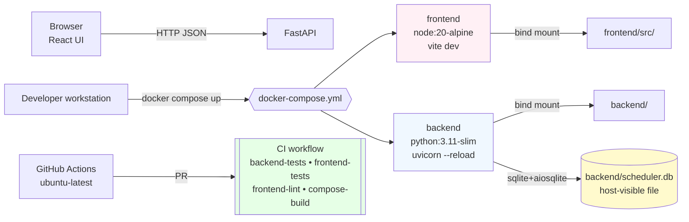

**What the diagram says**:
- Two containers, one SQLite file on the host shared by the venv workflow
  and the Docker workflow.
- CI runs four independent jobs on every PR; none of them need Docker to be
  running except `compose-build` (which only `build`s, doesn't `up`).

### 1.2 Current backend modules

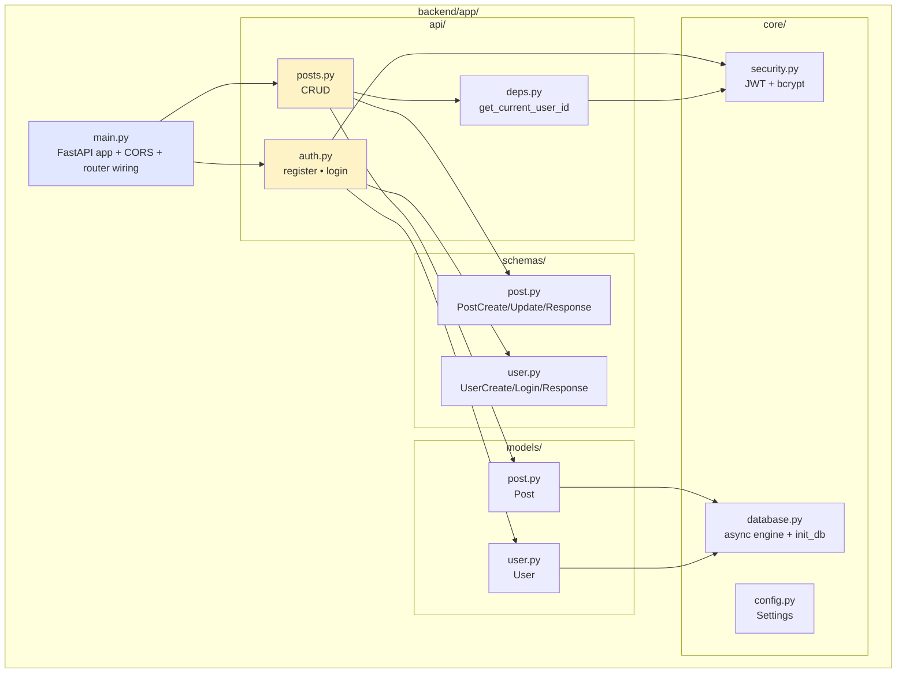

### 1.3 Current data model (ER)

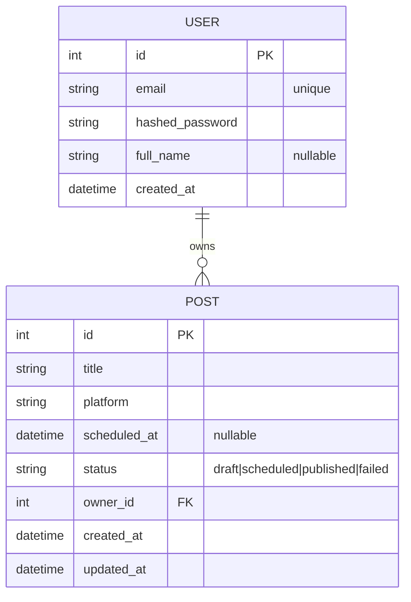

### 1.4 Current critical paths

**Post creation today (NO invariant enforcement)**:

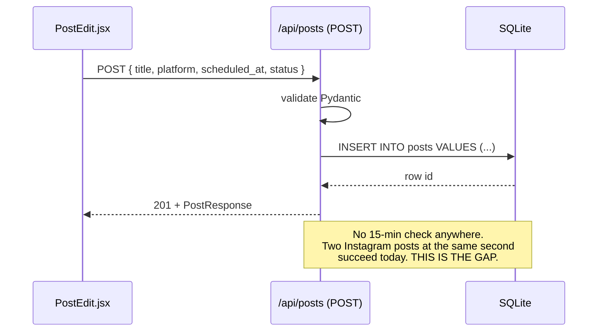

### 1.5 Gaps surfaced by `plan/gaps.md`

- `Series` concept entirely absent (no model, schema, API, UI).
- **15-min same-platform invariant is NOT enforced** — the exact gap the
  Content Series feature must close (Constitution Principle III).
- `PostResponse` has no way to surface series membership to the UI.

---

## 2. Proposed state (with Content Series)

### 2.1 System context — deltas

Nothing changes at the infrastructure layer. Same containers, same DB
file, same CI workflow. All additions are in application code and in the
schema of the existing SQLite file:

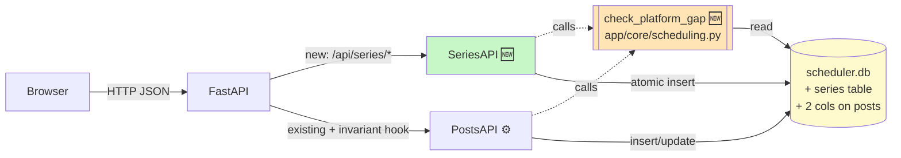

**Call-outs**:
- `PostsAPI` is the existing module; it gains **two** call sites to
  `check_platform_gap` (in `create_post` and `update_post`). No other
  refactor.
- `SeriesAPI` is brand new. It is the primary consumer of the invariant
  during bulk materialization.
- `check_platform_gap` is pure-read; it never writes. Writes stay in the
  two API modules.

### 2.2 Updated backend module map

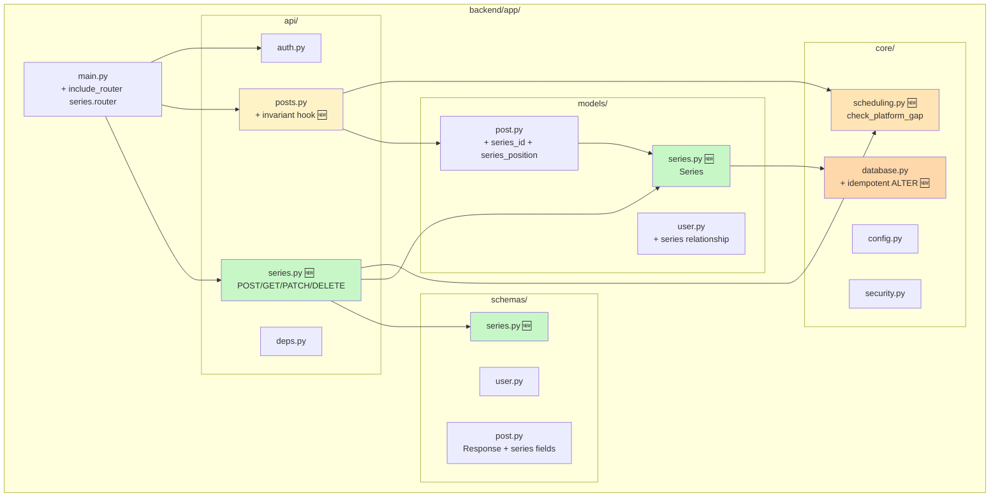

### 2.3 Updated ER diagram (Series added)

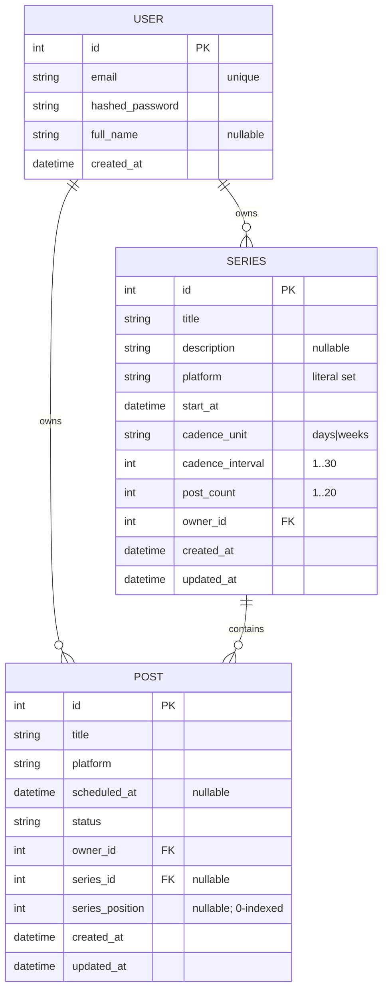

Invariant (code-level, not DB-level): `series_id IS NULL` iff
`series_position IS NULL`.

### 2.4 Series creation flow (happy path)

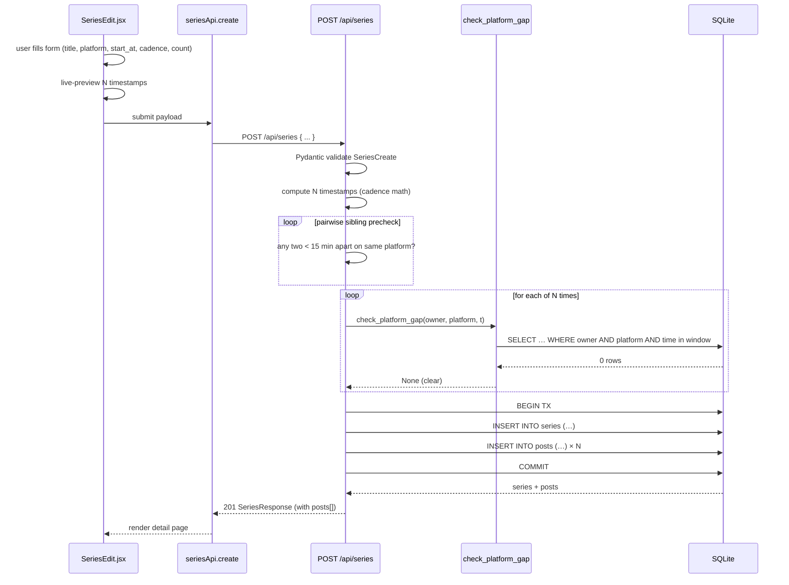

### 2.5 Series creation flow (conflict path — atomic abort)

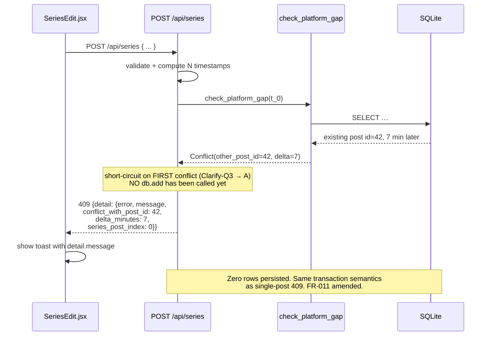

### 2.6 15-min invariant decision tree

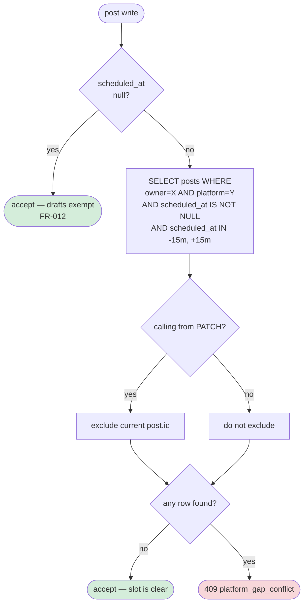

The strict-less-than boundary (`> lower AND < upper`) is the reason
**exactly 15 min apart is accepted** — matches the spec's one scrutinized
assertion.

### 2.7 Frontend route + component map

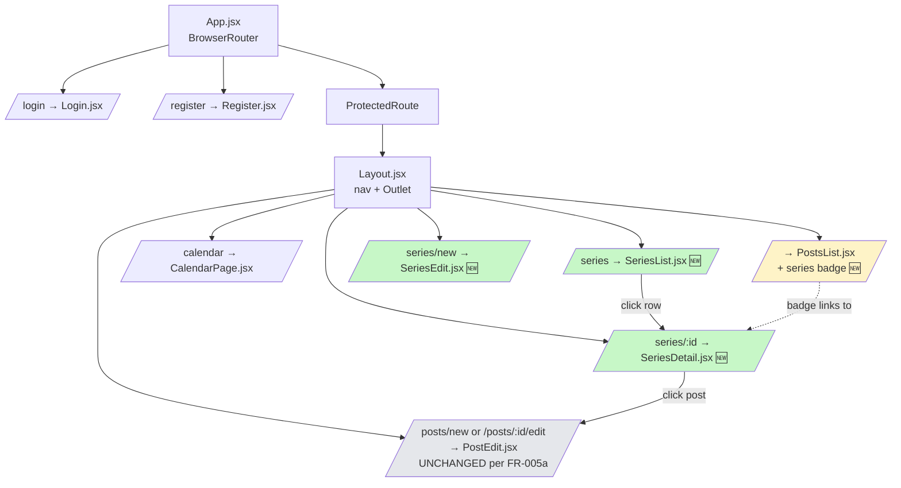

Green = new. Yellow = existing, minor edit (badge only). Gray = untouched.

### 2.8 DB rollout strategy

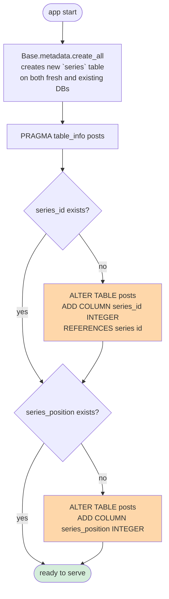

On existing reviewer DB: both ALTERs run once. On fresh DB or subsequent
restarts: both short-circuit. Reviewers run nothing extra (SC-003).

## 3. Delta summary (what changed between current and proposed)

| Layer | Added | Modified | Removed |
|---|---|---|---|
| `backend/app/core/` | `scheduling.py` | `database.py` (idempotent ALTER) | — |
| `backend/app/models/` | `series.py` | `post.py` (2 cols), `user.py` (relationship) | — |
| `backend/app/schemas/` | `series.py` | `post.py` (`PostResponse` gains read-only series fields) | — |
| `backend/app/api/` | `series.py` | `posts.py` (invariant wiring) | — |
| `backend/app/` | — | `main.py` (one `include_router` line) | — |
| `backend/tests/` | `test_scheduling.py`, `test_series.py` | `test_posts.py` (invariant cases) | — |
| `frontend/src/api/` | — | `client.js` (+ `seriesApi`) | — |
| `frontend/src/pages/` | `SeriesList.jsx`, `SeriesEdit.jsx`, `SeriesDetail.jsx` | `PostsList.jsx` (badge) | — |
| `frontend/src/components/` | — | `Layout.jsx` (nav link) | — |
| `frontend/src/` | — | `App.jsx` (3 new routes) | — |
| CI / infra | — | none | — |

Not touched (deliberately): `frontend/src/pages/PostEdit.jsx`,
`frontend/src/pages/Login.jsx`, `frontend/src/pages/Register.jsx`,
`frontend/src/pages/CalendarPage.jsx`, `backend/app/api/auth.py`,
`backend/app/core/security.py`, `backend/scripts/seed_data.py` (optional
enrichment, kept untouched by default).

## 4. Open questions

**None** at the pre-`/speckit-tasks` gate. Principle VI check passes.
