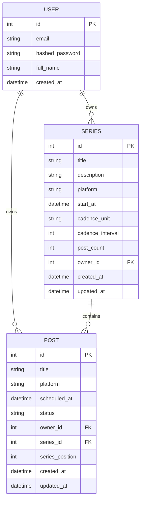
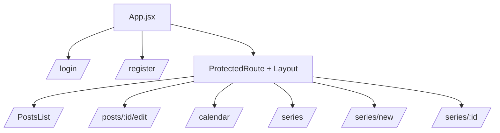
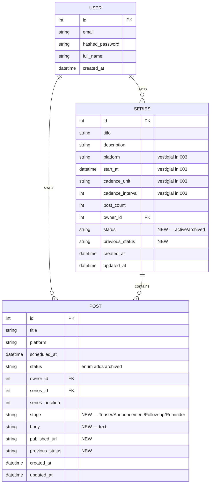
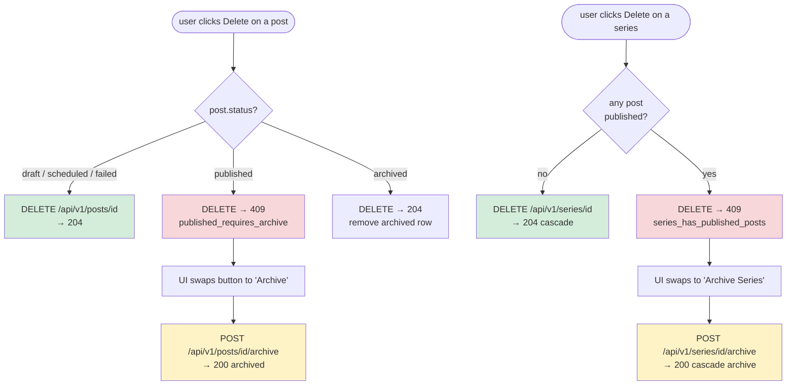
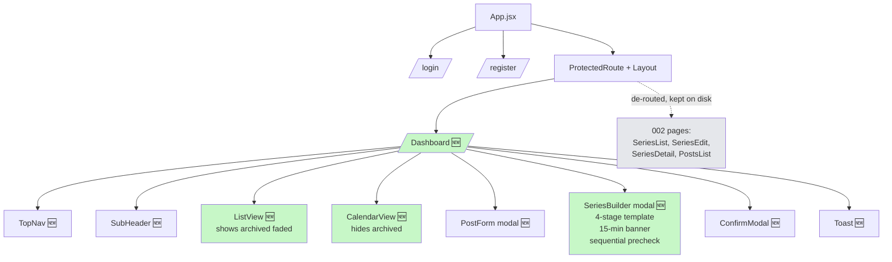
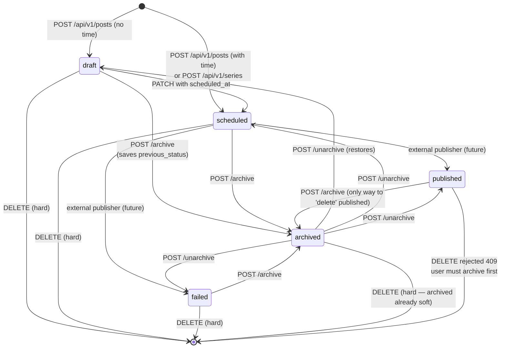

# High-Level Design: Content Management (003 upgrade)

**Feature**: `specs/003-content-management`
**Date**: 2026-04-22
**Audience**: reviewer / new contributor approaching the 003 upgrade cold.

Two halves: what exists after 002 merged, and what 003 adds on top.

---

## 1. Current state (after 001 + 002)

### 1.1 System context

```mermaid
flowchart LR
    Browser[Browser<br/>React 19 / Vite] -->|HTTP JSON| FastAPI
    FastAPI --> Auth[/auth/*]
    FastAPI --> Posts[/posts/* with 15-min invariant]
    FastAPI --> Series[/series/* v1 cadence-based]
    Posts -.->|calls| SG[[check_platform_gap<br/>app/core/scheduling.py]]
    Series -.->|calls| SG
    FastAPI -->|async SQLAlchemy| DB[(scheduler.db<br/>SQLite)]
    CI[GitHub Actions<br/>4 parallel jobs] -->|on every PR| Repo
```

### 1.2 ER diagram



### 1.3 Frontend page map



### 1.4 002 limits 003 will address

- `Post` has no `body` column — creators can only write a title.
- `status` enum lacks a "soft-deleted" terminal; published posts can only be hard-deleted.
- Series must be single-platform; posts within a series can't change platform (FR-005b).
- Cadence-driven series creation (user picks an interval) doesn't match the template-driven UX 003 ships.
- No per-view archive filter; no recovery path.

---

## 2. Proposed state (003 upgrade)

### 2.1 System context

```mermaid
flowchart LR
    Browser --> FastAPI
    FastAPI --> Auth[/auth/*]
    FastAPI --> PostsApi[/posts/*<br/>+ archive / unarchive 🆕<br/>+ sequential-integrity re-check 🆕<br/>invariant excludes archived 🆕]
    FastAPI --> SeriesV1[/series/* legacy]
    FastAPI --> SeriesApi[/api/v1/series 🆕 templated body<br/>+ archive / unarchive 🆕<br/>+ delete guard for published 🆕]
    PostsApi -.-> SG[[check_platform_gap<br/>now excludes archived]]
    PostsApi -.-> SI[[check_sequential_integrity 🆕]]
    SeriesApi -.-> SG
    SeriesApi -.-> SI
    FastAPI --> DB[(scheduler.db<br/>+ body, published_url,<br/>stage, previous_status on posts<br/>+ status, previous_status on series)]

    style PostsApi fill:#fef3c7
    style SeriesApi fill:#c7f7c7
    style SI fill:#ffe4b5
    style SG fill:#ffe4b5
    style DB fill:#fffacd
```

### 2.2 ER diagram (003 deltas highlighted)



### 2.3 Series-creation sequence (templated 4-stage)

```mermaid
sequenceDiagram
    participant UI as SeriesBuilder (ported CCM)
    participant API as POST /api/v1/series
    participant SI as check_sequential_integrity
    participant SG as check_platform_gap
    participant DB as SQLite

    UI->>UI: user fills 4 stages (platform, title, body, date+time)
    UI->>UI: client pre-check: sequential + 15-min
    UI->>API: POST { name, description, stages[4] }
    API->>API: validate Pydantic (stage labels + order)
    API->>SI: check_sequential_integrity(times)
    SI-->>API: None (ok) | SeqConflict
    loop for each of 4 stages
        API->>SG: check_platform_gap(owner, stage.platform, stage.time)
        SG->>DB: SELECT posts WHERE ... AND status != 'archived'
        DB-->>SG: 0 rows | conflict row
        SG-->>API: None | Conflict
    end
    API->>API: pairwise stage 15-min (same-platform siblings)
    API->>DB: BEGIN; INSERT Series; INSERT 4 Posts; COMMIT
    DB-->>API: rows
    API-->>UI: 201 SeriesResponse (with 4 posts[])
```

### 2.4 Delete / archive decision tree



### 2.5 Frontend page + component map (003)



### 2.6 Status state machine (003)



## 3. Delta summary

| Layer | New | Modified | Removed |
|---|---|---|---|
| `backend/app/core/scheduling.py` | `check_sequential_integrity`, `SeqConflict` | `check_platform_gap` (archive exclusion) | — |
| `backend/app/core/database.py` | — | `init_db` idempotent ALTER block extended | — |
| `backend/app/models/post.py` | — | +4 columns | — |
| `backend/app/models/series.py` | — | +2 columns | — |
| `backend/app/schemas/post.py` | — | `body` on Create/Update; new read-only fields + derived `author` on Response | — |
| `backend/app/schemas/series.py` | `SeriesApiCreate`, `SeriesApiStagePayload` | — | — |
| `backend/app/api/v1/posts.py` | `archive`, `unarchive` handlers; `include_archived` query param; DELETE guard | PATCH drops FR-005b; PATCH adds sequential integrity re-check | FR-005b platform-guard branch |
| `backend/app/api/v1/series.py` | Templated create, archive, unarchive handlers; DELETE guard | List `include_archived` param | — |
| `backend/tests/test_posts.py` | archive / unarchive / DELETE guard / FR-005b removal | +20 cases | one test rewritten |
| `backend/tests/test_scheduling.py` | archive exclusion, sequential integrity | — | — |
| `backend/tests/test_series.py` | — | one test rewritten | — |
| `backend/tests/test_series.py` | — | New cases added for archival, templated create, and Sequential Integrity | — |
| `frontend/package.json` | — | +tailwindcss/postcss/autoprefixer/lucide-react | — |
| `frontend/postcss.config.js`, `tailwind.config.js` | NEW | — | — |
| `frontend/src/components/` | NEW: `ListView.jsx`, `CalendarView.jsx`, `PostForm.jsx`, `SeriesBuilder.jsx`, `ConfirmModal.jsx`, `Toast.jsx`, `Primitives.jsx`, `Icon.jsx`, `utils.js` | `Layout.jsx` rewritten for CCM nav pattern | — |
| `frontend/src/pages/Dashboard.jsx` | NEW | — | — |
| `frontend/src/pages/` | — | — | `PostsList.jsx`, `PostEdit.jsx`, `CalendarPage.jsx`, `SeriesList.jsx`, `SeriesEdit.jsx`, `SeriesDetail.jsx` (all 6 deleted) |
| `frontend/src/App.jsx` | — | Routes simplified to `/login`, `/register`, `/` → Dashboard; 002 routes removed | — |
| `frontend/src/api/client.js` | archive/unarchive methods, `include_archived` param | `seriesApi.create` body updated to 4-stage shape; `API_BASE` → `/api/v1` | — |
| `frontend/src/api/client.test.js` | — | +Vitest cases for new API | — |
| `readme.md` | — | Short "003 upgrade" section | — |

## 4. Open questions

**None** at this gate. Thirteen prior clarifications + ten research
decisions cover every surface.
